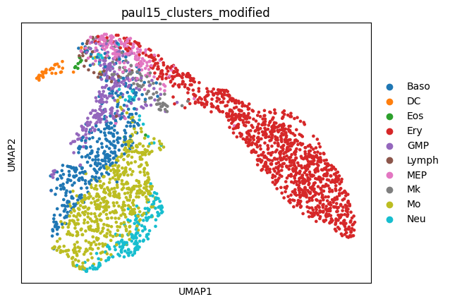
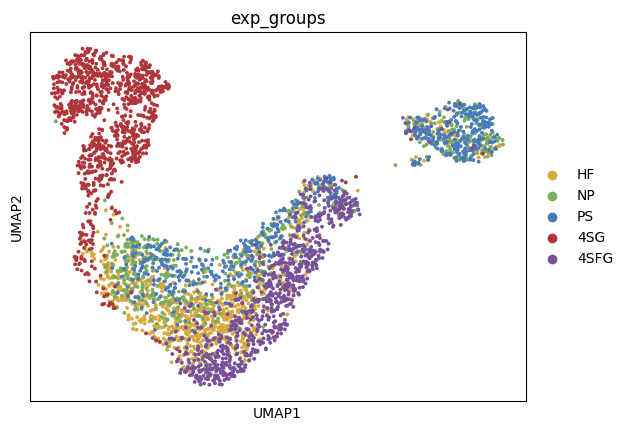
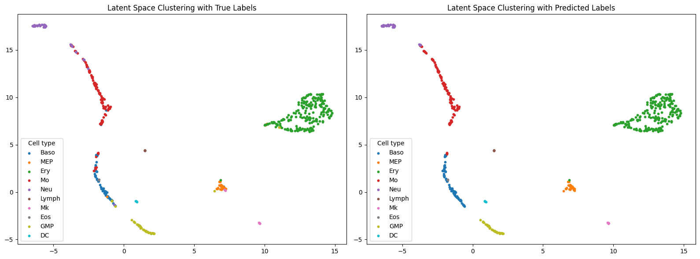

# Cell Type Prediction Using Transformer on Single-Cell RNA-seq Data

This repository contains a deep learning project utilizing a Transformer-based model to predict cell types using single-cell RNA-seq (scRNA-seq) data. The model achieves **92.86% accuracy** on a 10-class dataset and demonstrates superior performance when trained on raw count data compared to normalized data.

## Features

- **Transformer-based architecture**: A novel classification model incorporating Transformer layers for enhanced performance.
- **Support for raw count data**: The model outperforms on raw count data, making preprocessing optional.
- **Visualization of latent space**: Visualizes cell type clusters in the latent space using UMAP.
- **Generalizable**: Tested on multiple single-cell datasets (e.g., `paul15`, `moignard15`).

---

## Installation

### Prerequisites
- Python 3.8+
- PyTorch 1.9+
- Additional dependencies:
  ```bash
  pip install numpy matplotlib scanpy umap scikit-learn
  ```

---

## Model Architecture

### Overview
The model comprises three main components:
1. **Encoder**: Compresses high-dimensional input into a latent representation, to mimic RNA to high-level RNA regulators.
2. **Embeding**: Embeds high-level RNA regulators to features.
3. **Transformer**: Processes the latent representation to capture dependencies between regulators.
4. **Classifier**: Outputs predicted cell type probabilities.

### Code Example
```python
class ClassificationModel(nn.Module):
    def __init__(self, input_dim, latent_dim, embed_dim, num_classes, num_heads=2, num_layers=2, dropout=0.1):
        """
        A classification model with a transformer layer applied to the encoded features as a sequence.

        Args:
            input_dim (int): Number of features in the input.
            latent_dim (int): Dimensionality of the latent space.
            embed_dim (int): Dimensionality of token embeddings.
            num_classes (int): Number of output classes.
            num_heads (int): Number of attention heads in the transformer layer.
            num_layers (int): Number of transformer encoder layers.
            dropout (float): Dropout rate in the transformer.
        """
        super(ClassificationModel, self).__init__()

        # Encoder
        self.encoder = nn.Sequential(
            nn.Linear(input_dim, 256),
            nn.ReLU(),
            nn.Linear(256, 128),
            nn.ReLU(),
            nn.Linear(128, 64),
            nn.ReLU(),
            nn.Linear(64, latent_dim)
        )

        # Embedding
        self.feature_projection = nn.Linear(1, embed_dim)  # Expands feature dimension
        
        # Transformer  
        assert embed_dim % num_heads == 0, "embed_dim must be divisible by num_heads"
        encoder_layer = nn.TransformerEncoderLayer(
            d_model=embed_dim, nhead=num_heads, dim_feedforward=embed_dim * 4, dropout=dropout, batch_first=True
        )
        self.transformer = nn.TransformerEncoder(encoder_layer, num_layers=num_layers)

        # Classification
        self.classifier = nn.Linear(latent_dim * embed_dim, num_classes)  # Flattened transformer output

    def forward(self, x):
        # Apply encoder first
        latent = self.encoder(x)  # Shape: (batch_size, latent_dim)
        print(f"Encoder output shape: {latent.shape}")

        batch_size = latent.size(0)
        latent = latent.unsqueeze(2)  # Reshape to (batch_size, latent_dim, 1)

        # Expand feature representation
        latent = self.feature_projection(latent)  # Shape: (batch_size, latent_dim, embed_dim)

        # Apply transformer (batch_first=True means input shape is (batch, seq_len, d_model))
        transformer_output = self.transformer(latent)  # Shape: (batch_size, latent_dim, embed_dim)

        # Flatten sequence output before classification
        transformer_output = transformer_output.view(batch_size, -1)  # Shape: (batch_size, latent_dim * embed_dim)

        # Classification head
        predicted_labels = self.classifier(transformer_output)  # Shape: (batch_size, num_classes)

        return transformer_output, predicted_labels
```

---

## Dataset Details

### Dataset I: `paul15`
- **Description**: Contains raw count data with 10 cell types.
- **Preprocessing**:
  - PCA and UMAP for visualization.
  - Labels are encoded into integers.
    

### Dataset II: `moignard15`
- **Description**: Contains normalized data with 5 cell types.
- **Preprocessing**:
  - Similar steps as Dataset I.
    

---

## Training and Testing

### Training
Define hyperparameters:
```python
input_dim = X_train_tensor.shape[1]
latent_dim = 16
embed_dim = 32
num_classes = len(np.unique(y))
learning_rate = 0.001
batch_size = 32
num_epochs = 20
```
Train the model:
```python
epoch_losses = train_model(model, criterion, optimizer, X_train_tensor, y_train_tensor, num_epochs, batch_size)
plot_loss(epoch_losses)
```

### Testing
Evaluate the model:
```python
test_accuracy, classification_report_str, test_latent, test_predictions = test_model(model, X_test_tensor, y_test)
```

### Results
- **Dataset I**: 92.86% accuracy

- **Dataset II**: 76.75% accuracy

---

## Visualizing Latent Space
UMAP is used to visualize latent space clustering:
```python
latent_2d = umap.UMAP().fit_transform(test_latent)
plt.scatter(latent_2d[:, 0], latent_2d[:, 1], c=predicted_categories, cmap='viridis')
plt.title("Latent Space Visualization")
plt.show()
```
- **Dataset I**:
  


- **Dataset II**: 


---

## Key Observations
- **Performance**: Raw count data yields better results than normalized data.
- **Visualization**: Clear separation of cell types in latent space.

---

